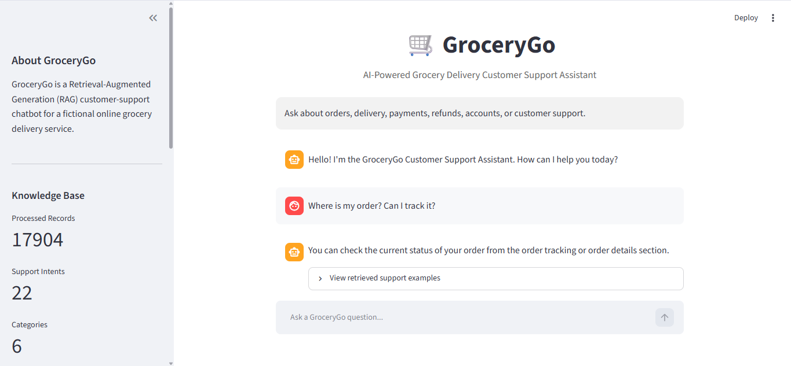

# 🛒 GroceryGo – AI-Powered Grocery Delivery Customer Support Chatbot

GroceryGo is a **Retrieval-Augmented Generation (RAG) customer support chatbot** designed for a fictional online grocery delivery service.

The application combines **semantic search, vector retrieval, and a Large Language Model (LLM)** to answer customer questions about orders, delivery, payments, refunds, accounts, and customer support.

Instead of relying only on keyword matching, GroceryGo uses **Sentence Transformer embeddings and FAISS** to retrieve semantically relevant customer-support examples and provides the retrieved information to **Google Gemini** for grounded response generation.

---

## 🖥️ Application Preview



The Streamlit interface provides an interactive chat experience and displays key knowledge-base statistics, including **17,904 processed records, 22 support intents, and 6 support categories**.

---

## ✨ Features

- 💬 Interactive AI customer-support chatbot
- 🔎 Semantic search instead of exact keyword matching
- 🧠 Retrieval-Augmented Generation (RAG)
- 📚 Real customer-support dataset from Kaggle
- 🗂️ 17,904 processed customer-support records
- 🎯 22 selected customer-support intents
- 📦 6 GroceryGo support categories
- 🔢 384-dimensional sentence embeddings
- ⚡ FAISS vector similarity search
- 🤖 Google Gemini response generation
- 🛡️ Grounded responses to reduce unsupported answers
- 🚫 Controlled fallback for out-of-domain questions
- 📖 Retrieved support examples visible in the UI
- 🧪 Dataset, retrieval, and end-to-end chatbot tests
- 🌐 Interactive Streamlit web interface

---

## 🧠 How It Works

GroceryGo follows a complete Retrieval-Augmented Generation pipeline:

```text
Kaggle Bitext Dataset
        ↓
Data Cleaning & Intent Filtering
        ↓
17,904 Processed Customer Utterances
        ↓
LangChain Documents
        ↓
all-MiniLM-L6-v2 Embeddings
        ↓
FAISS Vector Store
        ↓
User Question
        ↓
Question Embedding
        ↓
Semantic Similarity Search
        ↓
Top Relevant Support Examples
        ↓
Dominant Intent Selection
        ↓
Approved GroceryGo Response Context
        ↓
Google Gemini
        ↓
Final Customer Response
```

When a user submits a question, the system retrieves semantically similar customer-support examples instead of relying on exact keyword matching.

The chatbot initially retrieves the **top 5 similar documents**. It determines the dominant intent among the retrieved documents and selects up to **3 documents belonging to that intent** as context for Gemini.

This allows the LLM to generate a natural response while remaining grounded in the approved GroceryGo support information.

---

## 🗃️ Dataset

The project uses the **Bitext customer-support dataset** obtained from Kaggle.

### Original Dataset

| Property | Value |
|---|---:|
| Records | 21,534 |
| Features | 4 |
| Categories | 11 |
| Intents | 27 |

The original dataset contains the following features:

- `flags`
- `utterance`
- `category`
- `intent`

### Processed GroceryGo Dataset

After cleaning, duplicate removal, scope filtering, and intent selection:

| Property | Value |
|---|---:|
| Processed Records | 17,904 |
| Selected Intents | 22 |
| Display Categories | 6 |
| LangChain Documents | 17,904 |

### GroceryGo Categories

| Category | Records |
|---|---:|
| Payment | 4,635 |
| Account | 4,557 |
| Support | 3,827 |
| Orders | 2,249 |
| Refunds | 1,929 |
| Delivery | 707 |
| **Total** | **17,904** |

The original Bitext dataset contains customer utterances and intent labels rather than GroceryGo-specific answers.

For this project, relevant intents are therefore mapped to **controlled GroceryGo support responses**. These responses provide the approved context used during answer generation.

---

## 🎯 Supported Intents

The final knowledge base contains 22 customer-support intents:

```text
create_account
recover_password
registration_problems
edit_account
delete_account
switch_account

place_order
change_order
cancel_order
track_order

delivery_options
delivery_period
change_shipping_address
set_up_shipping_address

check_payment_methods
payment_issue

get_refund
check_refund_policy
track_refund

contact_customer_service
contact_human_agent
complaint
```

These intents cover common customer-support scenarios involving accounts, orders, deliveries, payments, refunds, and support requests.

---

## 🛠️ Tech Stack

| Technology | Purpose |
|---|---|
| **Python** | Main programming language |
| **Pandas** | Dataset loading and preprocessing |
| **LangChain** | RAG orchestration and document handling |
| **Sentence Transformers** | Semantic text embeddings |
| **all-MiniLM-L6-v2** | Embedding model |
| **FAISS** | Vector similarity search |
| **Google Gemini** | Grounded response generation |
| **Streamlit** | Interactive web interface |
| **python-dotenv** | Environment variable management |

---

## 🔎 Semantic Embeddings

GroceryGo uses the Sentence Transformer model:

```text
sentence-transformers/all-MiniLM-L6-v2
```

The model converts customer questions into **384-dimensional dense vectors** representing their semantic meaning.

For example, a customer might ask:

```text
Where is my order? I want to track it.
```

while a dataset example might say:

```text
I wanna track my order, can you tell me where I can do it?
```

Although the wording is different, the embedding model can represent the similarity in meaning. FAISS can then retrieve the relevant support examples.

---

## 🔍 Retrieval Strategy

For each customer question, GroceryGo:

1. Converts the question into an embedding.
2. Searches the FAISS vector store.
3. Retrieves the top 5 semantically similar documents.
4. Identifies the dominant intent among those documents.
5. Selects up to 3 documents belonging to that intent.
6. Builds an approved support context.
7. Sends the question and retrieved context to Gemini.
8. Generates the final grounded customer response.

This combines deterministic retrieval with natural-language generation.

---

## 🧪 Retrieval Evaluation

A small evaluation set containing six paraphrased customer questions was used to test semantic retrieval.

| Query Type | Expected Intent | Result |
|---|---|---|
| Password recovery | `recover_password` | ✅ Correct |
| Order tracking | `track_order` | ✅ Correct |
| Payment methods | `check_payment_methods` | ✅ Correct |
| Refund request | `get_refund` | ✅ Correct |
| Delivery period | `delivery_period` | ✅ Correct |
| Human support | `contact_human_agent` | ✅ Correct |

### Evaluation Result

```text
6/6 test queries retrieved the expected intent at rank 1.
```

> **Note:** This result applies only to the six-query evaluation set and should not be interpreted as 100% accuracy across all possible customer questions.

---

## 💬 Example Conversations

### 📦 Order Tracking

**User:**

```text
Where is my order? Can I track it?
```

**GroceryGo:**

```text
You can check the current status of your order from the
order tracking or order details section.
```

---

### 🚚 Delivery

**User:**

```text
How long does delivery take?
```

**GroceryGo:**

```text
The available delivery period or estimated delivery time
is shown when arranging delivery for your order.
```

---

### 💳 Refund

**User:**

```text
I want to request a refund.
```

**GroceryGo:**

```text
You can request a refund through the appropriate order-help
or customer-support option. Refund approval depends on the
applicable refund policy and the details of the request.
```

---

### 🚫 Out-of-Domain Question

**User:**

```text
Who invented the telephone?
```

**GroceryGo:**

```text
I don't have enough information in the GroceryGo knowledge
base to answer that question. Please contact customer support.
```

This behavior helps prevent the chatbot from answering unrelated questions using the LLM's general knowledge.

---

## 🛡️ Grounding and Hallucination Control

A major goal of GroceryGo is to keep generated responses grounded in the customer-support knowledge base.

The Gemini prompt instructs the model to answer using only the approved information supplied through the RAG pipeline.

The model is instructed not to invent unsupported information such as:

- Prices
- Discounts
- Delivery times
- Payment methods
- Refund guarantees
- Company policies
- Unsupported procedures

When sufficient information is unavailable, the chatbot can return a controlled fallback response rather than relying on unrelated general knowledge.

---

## 📁 Project Structure

```text
grocerygo-rag-chatbot/
│
├── assets/
│   └── grocerygo-demo.png
│
├── src/
│   ├── __init__.py
│   ├── data_loader.py
│   ├── vector_store.py
│   └── chatbot.py
│
├── app.py
├── bitext_customer_support.csv
├── requirements.txt
├── .gitignore
├── test_data.py
├── test_vector.py
├── test_chatbot.py
└── README.md
```

> `.env`, `.venv`, `__pycache__`, and generated FAISS index files are intentionally excluded from version control.

---

## 🚀 Installation

### 1. Clone the Repository

```bash
git clone https://github.com/emaanashraf12/grocerygo-rag-chatbot.git
cd grocerygo-rag-chatbot
```

### 2. Create a Virtual Environment

```bash
python -m venv .venv
```

### 3. Activate the Environment

#### Windows PowerShell

```powershell
.\.venv\Scripts\Activate.ps1
```

#### macOS/Linux

```bash
source .venv/bin/activate
```

### 4. Install Dependencies

```bash
pip install -r requirements.txt
```

---

## 🔑 Google Gemini API Configuration

The application requires a Google Gemini API key.

Create a file named:

```text
.env
```

in the root directory of the project.

Add:

```env
GOOGLE_API_KEY=your_google_api_key_here
```

Replace `your_google_api_key_here` with your own Gemini API key.

### ⚠️ Security

Never commit your real API key to GitHub.

The project's `.gitignore` should contain:

```gitignore
.venv/
.env
__pycache__/
*.pyc
faiss_index/
```

This keeps sensitive credentials and unnecessary generated files out of version control.

---

## ▶️ Running the Application

Start the Streamlit application with:

```bash
streamlit run app.py
```

Streamlit will start the application and provide a local URL.

Open that URL in your browser to use GroceryGo.

Example:

```text
http://localhost:8501
```

---

## 🧪 Running the Tests

The project contains separate scripts for testing preprocessing, semantic retrieval, and the complete chatbot pipeline.

### 1. Dataset Preprocessing Test

```bash
python test_data.py
```

This verifies dataset loading and preprocessing.

Expected processed dataset size:

```text
Processed records: 17904
```

### 2. Semantic Retrieval Test

```bash
python test_vector.py
```

This evaluates whether FAISS retrieves the expected support intent for the evaluation queries.

Current result:

```text
6/6 test queries retrieved the expected intent at rank 1.
```

### 3. End-to-End RAG Test

```bash
python test_chatbot.py
```

This tests the complete pipeline:

```text
Customer Question
        ↓
Embedding
        ↓
FAISS Retrieval
        ↓
Dominant Intent Selection
        ↓
Approved Context
        ↓
Google Gemini
        ↓
Grounded Response
```

> Gemini API rate limits may affect repeated end-to-end tests depending on the API quota available to the user.

---

## ⚠️ Limitations

GroceryGo is an educational demonstration and not a production grocery-delivery platform.

Current limitations include:

- The retrieval evaluation currently uses a small six-query test set.
- FAISS always returns nearest neighbors, including for unrelated queries.
- There is currently no calibrated similarity threshold for out-of-domain detection.
- GroceryGo support responses are project-defined rather than policies from a real grocery company.
- The chatbot does not connect to live customer accounts.
- It does not access real orders or delivery status.
- It does not process real payments or refunds.
- It does not access live inventory.
- The current implementation focuses on English.
- Gemini API quotas and internet availability can affect response generation.

---

## 🔮 Future Improvements

Future versions of GroceryGo could include:

- A larger held-out evaluation dataset
- Top-1 and Top-k retrieval metrics
- Precision, recall, and F1 evaluation
- Mean Reciprocal Rank (MRR)
- Similarity threshold for out-of-domain detection
- Dedicated intent classification
- Retrieval reranking
- Persistent FAISS index storage
- Multilingual embeddings
- Multilingual customer support
- Real order-tracking API integration
- Live inventory integration
- Payment and refund integrations
- Human-agent escalation
- User authentication and authorization
- Conversation history management
- Improved privacy and security controls

---

## 🎓 What I Learned

Building GroceryGo provided practical experience with:

- Natural Language Processing
- Retrieval-Augmented Generation
- Transformer-based sentence embeddings
- Semantic similarity search
- Vector databases
- FAISS
- LangChain
- Prompt engineering
- LLM grounding
- Google Gemini integration
- Dataset preprocessing
- Streamlit application development
- Retrieval evaluation
- Out-of-domain query handling

This project demonstrates how retrieval and generative AI can be combined to build a more controlled and domain-focused customer-support assistant.

---

## 📚 Resources

This project uses technologies and resources from:

- **Bitext Customer Support Dataset** — Kaggle
- **Sentence Transformers / all-MiniLM-L6-v2** — Hugging Face
- **FAISS** — Meta AI Research
- **LangChain**
- **Google Gemini API**
- **Streamlit**

---

## 👤 Author

**Emaan Ashraf**

AI / Machine Learning Project

🔗 **GitHub:** `emaanashraf12`

---

## ⭐ Support

If you find this project useful or interesting, consider giving the repository a ⭐.

Feedback, suggestions, and contributions are welcome.
